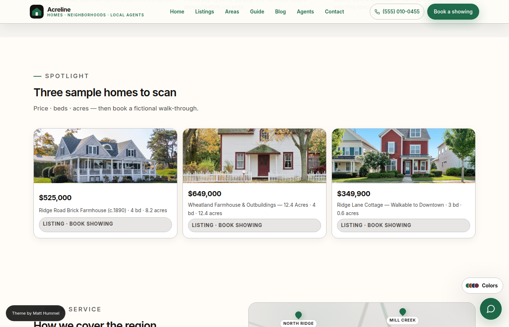
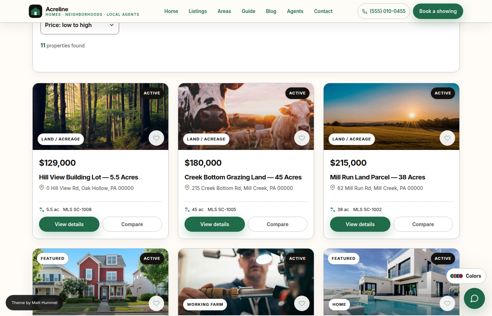
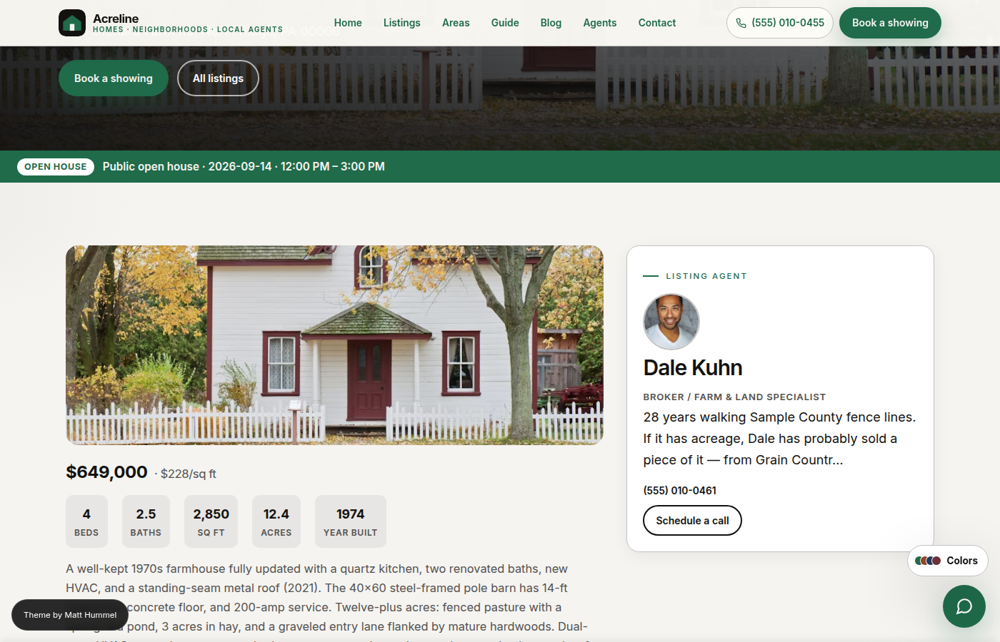
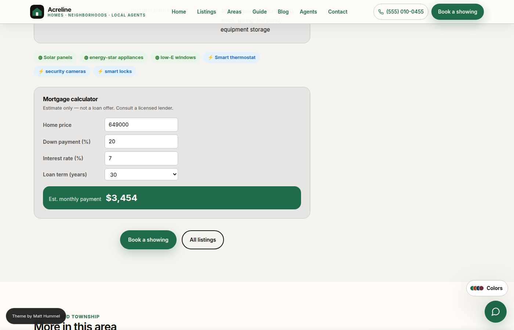
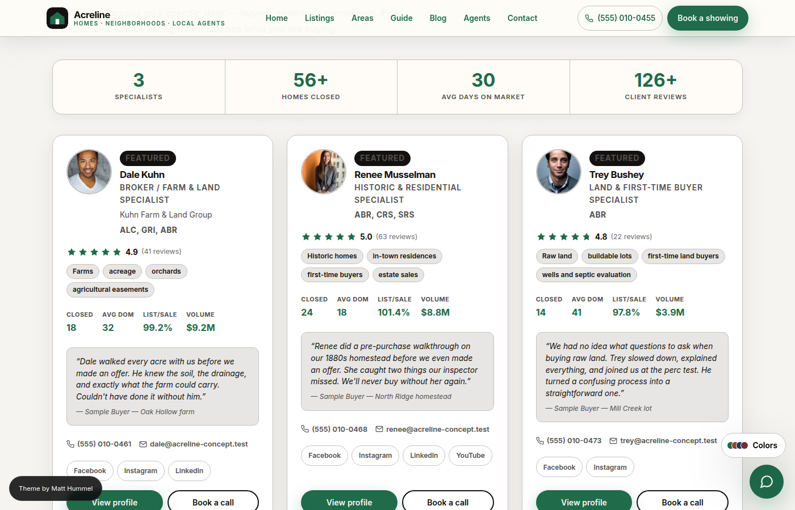
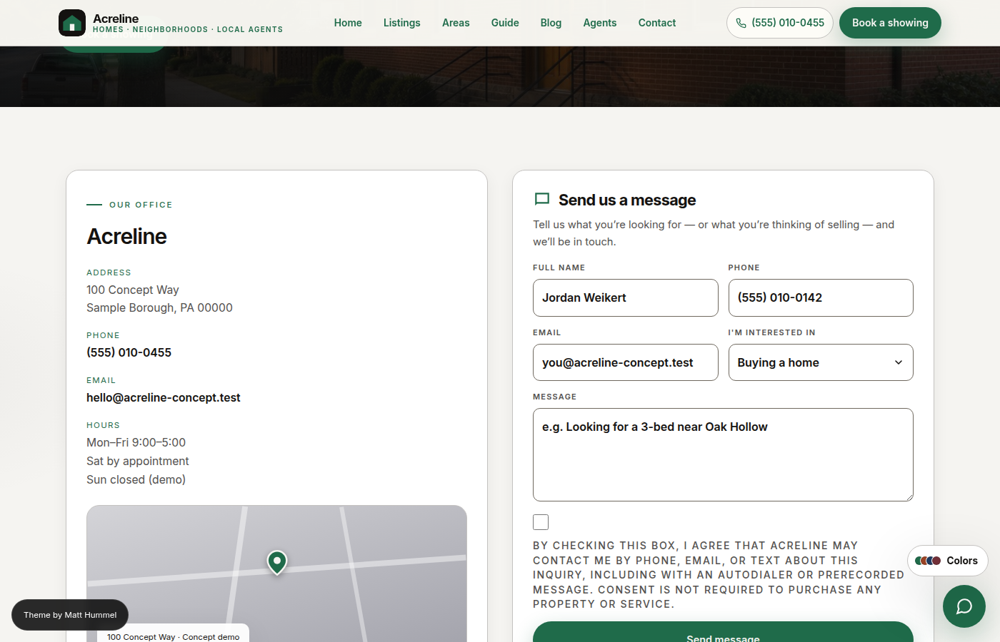
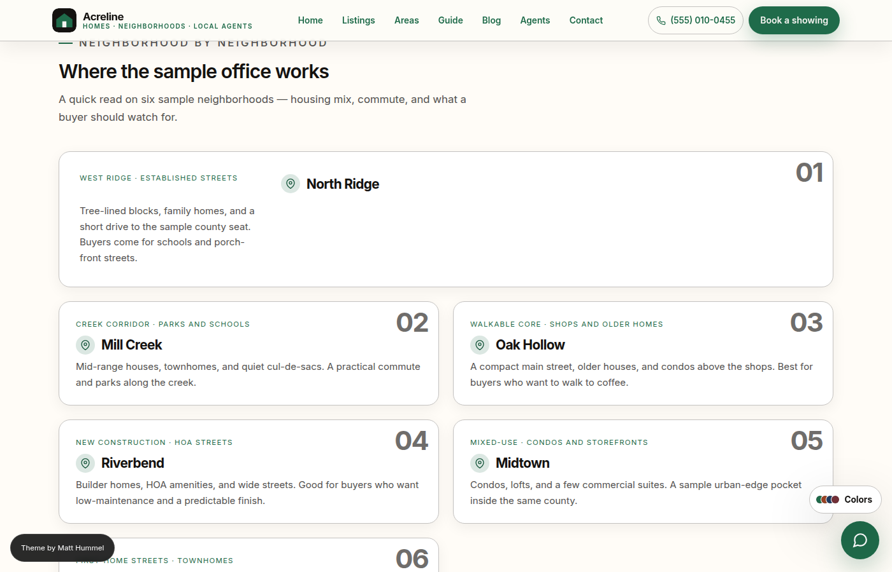
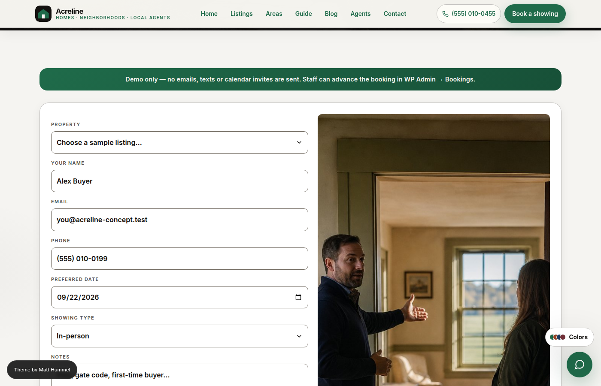
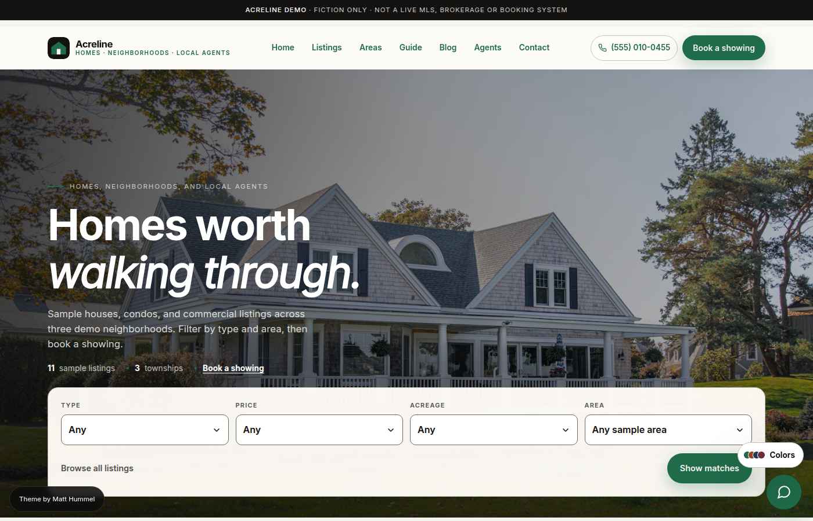

# Acreline — WordPress Theme for Real Estate Agents

**Acreline** is a WordPress theme for **solo agents and small teams** — featured homes, agent bios, and showing requests on Gutenberg marketing pages. No page builder, no ACF, and no IDX plugin required on day one.

|  |  |
| --- | --- |
| **Live demo** | [acreline.matthummel.com](https://acreline.matthummel.com/) |
| **Product page** | [matthummel.com/projects/acreline/](https://matthummel.com/projects/acreline/) |
| **Shop** | [matthummel.com/shop](https://matthummel.com/shop/) |
| **Buy / checkout** | [matthummel.com/product/acreline/](https://matthummel.com/product/acreline/) |
| **Support** | [matthummel.com/support/acreline/](https://matthummel.com/support/acreline/) · [GitHub Issues](https://github.com/matthummel-pa/wp-acreline/issues) |
| **Author** | [Matt Hummel](https://matthummel.com/) |
| **Version** | 1.5.4 |

> **Fiction only.** The demo uses sample data — `555` phone numbers, `@acreline-concept.test` emails, concept listings. Not a live MLS, licensed brokerage, or booking system.

---

<!--  ──────────────────────── NAV ──────────────────────── -->

[📸 Screenshots](#screenshots) &nbsp;·&nbsp;
[✨ What's included](#whats-included) &nbsp;·&nbsp;
[🏠 Listings & Agents](#listings-agents-and-showings) &nbsp;·&nbsp;
[🎨 Customizer](#customizer) &nbsp;·&nbsp;
[🔝 Top Bar](#top-bar) &nbsp;·&nbsp;
[⚙️ Admin](#admin-pages) &nbsp;·&nbsp;
[🛒 Install](#install-from-a-marketplace-zip) &nbsp;·&nbsp;
[🔄 Updates](#one-click-updates) &nbsp;·&nbsp;
[📖 Docs](#documentation)

---

## Screenshots

> Desktop captures from the seeded concept demo. Same images used on [matthummel.com/projects/acreline/](https://matthummel.com/projects/acreline/).

| | |
|:---:|:---:|
|  |  |
| **Homepage** — Hero search · Intent cards · Featured listings | **Listings** — Filter bar (type, price, area) · Grid view |
|  |  |
| **Listing** — Photo, price, stats, sticky CTA | **Listing (scrolled)** — Mortgage calculator · Agent card · Book CTA |
|  |  |
| **Agents** — Stats · Designations · Social links | **Contact** — Office info from Customizer + message form |
|  |  |
| **Areas** — Sample market cards | **Book a Showing** — Request form · Agent selector |

### Top bar

**Desktop top bar (1.4.0)** — Announcement badge · Phone · Social icons · CTA pill. Hidden on mobile; content surfaces in the slide-out nav drawer instead.

---

## What's included

Day-one inventory, agent bios, and lead capture in **one zip** — no page builder, no ACF, no IDX subscription. Houzez, RealHomes, and WPResidence are built as listing portals. Acreline is built for an agent site.

### Why Acreline is different

| Feature | Acreline | Typical real-estate themes |
| --- | :---: | :---: |
| No page builder required | ✅ | Page builder license often needed |
| No ACF required | ✅ | ACF Pro often bundled |
| No IDX/MLS required | ✅ | IDX subscription often required |
| 32 custom Gutenberg blocks | ✅ | Most use shortcodes or Classic |
| Block Generator (no-code blocks) | ✅ | Unique to Acreline |
| Listing comparison modal | ✅ | Rare without paid add-ons |
| Saved listings (localStorage) | ✅ | Usually needs a plugin or login |
| Built-in mortgage calculator | ✅ | Usually a plugin |
| Market snapshot shortcode | ✅ | Usually a plugin |
| Open house + virtual tour fields | ✅ | Often paid add-ons |
| Agent performance stats | ✅ | Rarely included |
| Desktop top bar with mobile fallback | ✅ | Rarely included |
| Fiction-only concept demo | ✅ | Required for honest marketplace listing |

### 32 custom Gutenberg blocks

Every marketing page is built with WordPress blocks that render server-side — what you see in the block editor matches the live site exactly.

| Block | What it does |
| --- | --- |
| Home Hero | Full-width hero with listing search; Ken Burns photo pan (on by default); optional phone tilt on the search panel (off) |
| Page Hero | Standard hero with photo, eyebrow, CTA buttons |
| Intent Cards | Buy / Sell / Tour three-card section |
| Featured Listings Spotlight | Dynamic grid of featured listings |
| Booking Form Section | Showing request form with editable header |
| Market Stats | Four editable market stat tiles |
| How It Works | Four-step tour process |
| Agent Tools | Home value estimator + listing alert forms |
| Area Grid | Up to six area cards with photos, card styles, and a section CTA |
| Region Coverage | Split map + neighborhood cards, or bento/grid; editable methods and CTAs |
| Pricing Plans | Three service/plan cards with a featured highlight |
| Logo Strip | Partner or brokerage wordmarks (optional grayscale) |
| Newsletter | Email signup band (demo form — nothing is emailed) |
| CTA Band | Full-width CTA with two buttons, three backgrounds |
| Intro Section | Eyebrow · title · lede copy |
| Listing Grid | Filter toolbar, card grid, and map view |
| Tools Section | Loan + pre-qual calculators |
| How We Work | Editable office-process steps |
| Office Info | Address, phone, email, hours from Customizer |
| Contact Form | Office info + message form side by side |
| FAQ List | Accordion, plain, or numbered format |
| Reviews | Testimonial cards |
| SEO Content Block | Long-form buying-guide copy |
| Booking Note + Form | Standalone booking page |
| Agent List | Agent grid with photo, stats, designations |
| Trust Strip | Four contact commitments |
| Buyer Checklist | Numbered property checklist |
| Showing Prep Checklist | Two-column buyer / agent prep lists |
| Area Compare Table | Side-by-side sample-market table |
| Topic Cards | Three scan cards for the blog index |
| Post Grid | Blog post cards + pagination |
| Custom Block | Output of the no-code Block Generator |

**Block Generator** (Tools → Block Generator) — create new content blocks without writing any code. Fields: text, textarea, URL, image picker, toggle.

**Migrate to Blocks** (Tools → Migrate to Blocks) — converts older `ks_*` meta page copy to block content in one click.

### Pages pre-built on install

| Page | Blocks included |
| --- | --- |
| Home | Hero · Intent Cards · Spotlight · Region Coverage · How It Works · Booking · Market Stats · Agent Tools · Pricing · Logo Strip · Newsletter · SEO Content · FAQ · Reviews · CTA |
| Listings | Page Hero · Listing Grid · Market Stats · Reviews · FAQ · Newsletter · CTA |
| Areas | Page Hero · Intro · Area Grid · Compare Table · Region Coverage · Market Stats · Reviews · Newsletter · CTA |
| Guide | Page Hero · Tools · How It Works · Checklist · FAQ · Reviews · Newsletter · CTA |
| Agents | Page Hero · Intro · Agent List · Reviews · Pricing · Logo Strip · How We Work · CTA |
| Contact | Page Hero · Contact Form · Office Info · Trust Strip · Intro · How We Work · Agent List · CTA |
| Book a showing | Page Hero · Booking Note + Form · Intro · Prep Checklist · FAQ · CTA |
| Blog | Page Hero · Topic Cards · Post Grid · Reviews · Newsletter · CTA |

---

## Listings, agents, and showings

- **Listing** — type, price, beds, baths, sqft, acres, township, MLS, status; utilities (water/sewer/heating/cooling), HOA, school district, flood zone, open house date/time, virtual + video tour, floor plan, green/eco features, smart home chips, outbuildings, tillable/pasture acres
- **Agent** — photo, bio, performance stats (homes sold, volume, avg DOM, list-to-sale ratio, review count), certifications/designations, social links (Facebook, Instagram, LinkedIn, YouTube), intro video URL, calendar URL, mobile, awards, team name
- **Booking** — showing type, date, time, assigned agent, client contact; buyer type, attendees, comm preference; pipeline (Requested → Confirmed → Completed)
- **Listing grid** — filter by type, price, area, and status; grid and map views
- **Comparison modal** — compare up to 3 listings side-by-side
- **Saved listings drawer** — heart icon saves to `localStorage`; floating button opens the slide-out panel
- **Sticky CTA bar** — price + "Book a showing" after the hero scrolls out on single listing pages
- **Share & print** — Web Share API with clipboard fallback; print-friendly property flyer
- **Recently viewed** — last 5 listings tracked in `localStorage`, shown as chips on detail pages
- **Nearby listings** — server-rendered same-township listings, no API required
- **Market snapshot** — `[acreline_market_snapshot]` shortcode; values set in Theme Settings → Market
- **Mortgage calculator** — built-in, no plugin or API; editable rate, term, down payment
- **Media picker** — native WP media library for all image fields

---

## Customizer

**Appearance → Customize** — everything a buyer changes day-to-day.

| Section | What you set |
| --- | --- |
| **Identity** | Brand name, tagline, phone, email, address, hours, header CTA, footer blurb, demo banner, author credit |
| **Compliance** | Brokerage legal name, optional licenses, Fair Housing, MLS/IDX slots, privacy/terms URLs, form consent (not legal advice) |
| **Site Identity** | Custom logo (replaces the Acreline house mark) |
| **Colors** | Eight presets: Forest · Clay · Navy · Burgundy · Harvest · Lake · Orchard · Charcoal — plus accent, paper, and ink pickers |
| **Header** | Sticky on/off, standard / compact height, homepage Ken Burns photo animation (`ks_hero_ken_burns`, on), optional mobile listing-search tilt (`ks_hero_search_tilt`, off) |
| **Top Bar** | Enable, color style, announcement badge + message + link, CTA pill, contact toggles, social icon toggles, dismiss option |
| **Typography** | Five font families; base size 14–20 px; heading weight |
| **Social links** | Facebook · Instagram · YouTube · LinkedIn · X |
| **GitHub** | Token for one-click theme updates |

Homepage hero motion lives under **Header** and **Appearance → Acreline Settings → General** (same saved values):

- **Animate homepage hero image** (`ks_hero_ken_burns`, **on**) — slow Ken Burns pan and zoom on the hero photo only. Headlines, overlay, and listing search stay still. Honors reduced motion.
- **Tilt listing search on mobile** (`ks_hero_search_tilt`, **off**) — on phones, the listing search panel gently follows device tilt. No-op on desktop, without sensors, if permission is denied, or if the visitor prefers reduced motion.

---

## Top bar

A configurable slim bar above the header — **desktop only** (hidden below 900 px). All enabled items automatically surface at the foot of the mobile nav drawer.

| Slot | What it shows |
| --- | --- |
| Left | Social icon links |
| Centre | Announcement badge + message (optionally linked) |
| Right | Phone · Email · Address · Hours · CTA pill button |
| Dismiss | Optional × button (sessionStorage) |

Four color style presets: **Dark** · **Accent** · **Light** · **Custom** (pick any background and text colors).

---

## Admin pages

| Page | Where | What it does |
| --- | --- | --- |
| **Acreline Setup** | Appearance → Acreline Setup | Five-step wizard — brand, phone, colors, demo content |
| **Acreline Settings** | Appearance → Acreline Settings | Tabbed settings — listings, agents, bookings, market, labels, general; iOS-style toggles |
| **Acreline Support** | Appearance → Acreline Support | Quick start, feature reference, shortcode cheatsheet, FAQ, changelog |

---

## System requirements

| | |
| --- | --- |
| **WordPress** | 6.6 or later |
| **PHP** | 8.3 or later |
| **Server** | Apache or Nginx |
| **Composer / npm on host** | **Not needed** — the theme zip ships compiled assets and production vendor |

---

## Install from a marketplace zip

1. Extract the outer `acreline-*.zip` — do not upload the outer file in wp-admin.
2. **Appearance → Themes → Add New → Upload Theme** → choose the inner **`acreline.zip`**. Activate. The folder must stay **`acreline`**.
3. **Appearance → Acreline Setup** — brand, colors, optional demo seed.
4. **Appearance → Customize → Identity** — phone, email, address, hours, header CTA, logo.
5. **Appearance → Customize → Top Bar** — optional announcement bar.
6. Optional: upload `acreline-child.zip` and `acreline-core.zip`.

Full buyer walkthrough with screenshots: open **`Documentation/index.html`** from your seller pack.

### What's in the pack

| File | Purpose |
| --- | --- |
| `acreline.zip` | Upload in Appearance → Themes |
| `acreline-child.zip` | Optional child theme |
| `acreline-core.zip` | Optional plugin — keeps listings if you switch themes |
| `Documentation/` | HTML buyer docs — open `index.html` first |
| `Demos/` | Seed notes (Tools → Seed Acreline demo) |
| `Licensing/` | GPLv2 notice and credits |

### Minimal plugin footprint

| Need | Solution |
| --- | --- |
| Listings, agents, bookings | **Theme zip only** — all registered in the theme |
| Listings survive a theme switch | **Acreline Core** |
| CSS survives parent updates | **Acreline Child** |
| SEO | **Nothing extra** — native tags built in; yields to Yoast / Rank Math / SEOPress / AIOSEO |

---

## One-click updates

CI publishes a built zip on the `theme-latest` GitHub release after every push to `main`.

1. **Appearance → Update Theme** in wp-admin.
2. Set a fine-grained GitHub PAT with **Contents: Read** in Customizer → GitHub (or `KS_GITHUB_TOKEN` in `wp-config.php`).
3. Click **Install latest zip from GitHub**.

Pages, posts, uploads, and Customizer settings are not touched.

---

## Branding

| Asset | Path |
| --- | --- |
| House mark | `public/images/brand/acreline-mark.svg` |
| Horizontal lockup | `public/images/brand/acreline-lockup.svg` |
| Forest ink | `#141210` |
| Forest paper | `#f5f4f1` |
| Forest accent | `#1f6b4a` |

Upload your own logo under **Appearance → Customize → Site Identity**. Eight built-in color styles; all swappable without touching code.

---

## Documentation

| File | Purpose |
| --- | --- |
| [`readme.txt`](readme.txt) | WordPress / ThemeForest parser |
| [`SUPPORT.md`](SUPPORT.md) | Support channels |
| [`CHANGELOG.md`](CHANGELOG.md) | Version history |
| [`CREDITS.md`](CREDITS.md) · [`LICENSE.md`](LICENSE.md) | Third-party licenses, GPL |
| [`BRAND.md`](BRAND.md) | Brand kit — palette, logo marks |
| [`docs/marketplace/index.html`](docs/marketplace/index.html) | Buyer docs hub — open first |
| [`docs/marketplace/buyer-guide.html`](docs/marketplace/buyer-guide.html) | Install, Customizer, top bar, fields, FAQ |
| [`docs/marketplace/compliance.html`](docs/marketplace/compliance.html) | Website compliance checklist (not legal advice) |
| [`docs/marketplace/screenshots/`](docs/marketplace/screenshots/) | 01–09 screenshots used on matthummel.com |
| [`public/images/brand/`](public/images/brand/) | House mark + lockup (SVG, GPLv2) |

> **Developer documentation** (local setup, Vite build, PHP lint, template map, build scripts): see [`DEVELOPMENT.md`](DEVELOPMENT.md) and [`AGENTS.md`](AGENTS.md).

---

## License

GPLv2 or later. See [`license.txt`](license.txt), [`LICENSE.md`](LICENSE.md), and [`CREDITS.md`](CREDITS.md). Sage / Acorn remain MIT.

Author: [Matt Hummel](https://matthummel.com/) · [acreline.matthummel.com](https://acreline.matthummel.com/)
