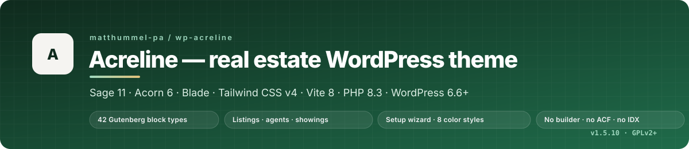
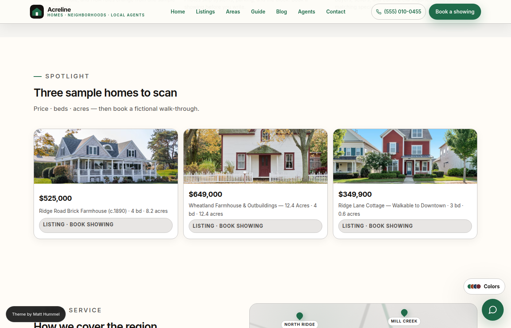
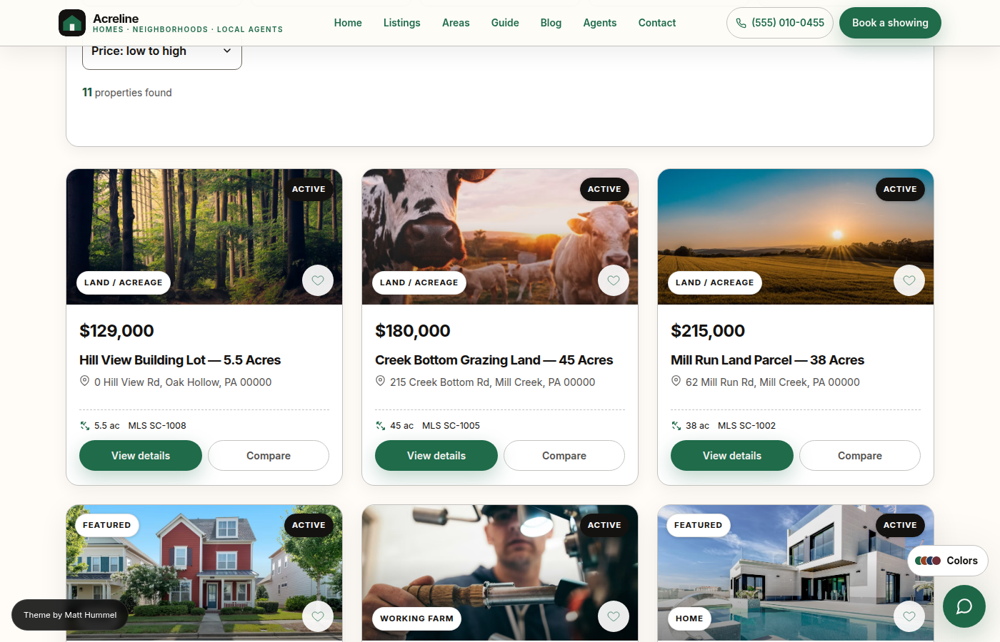
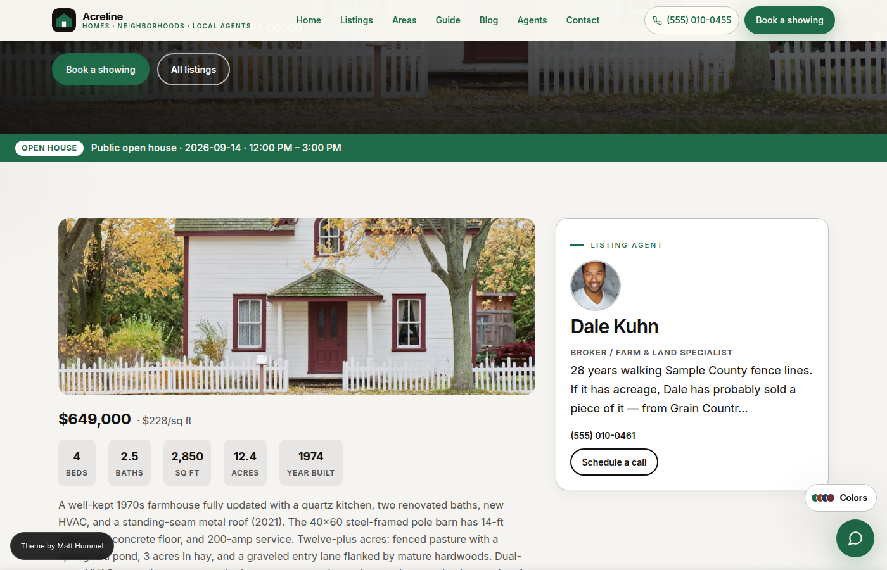
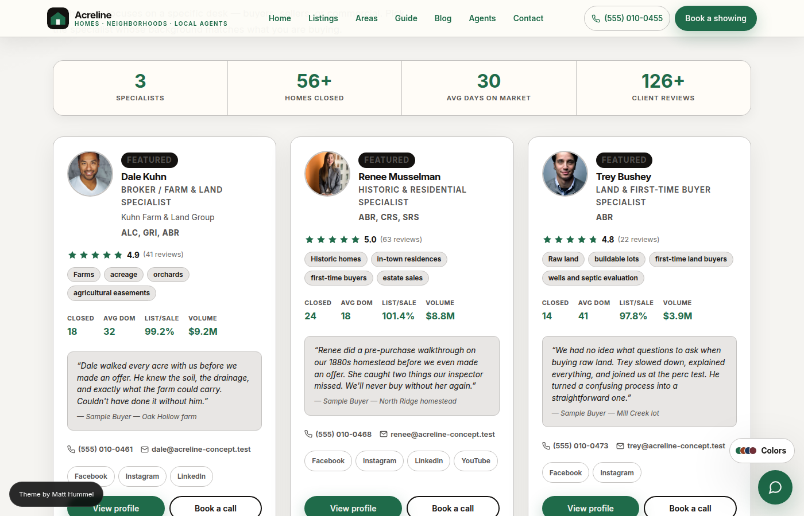
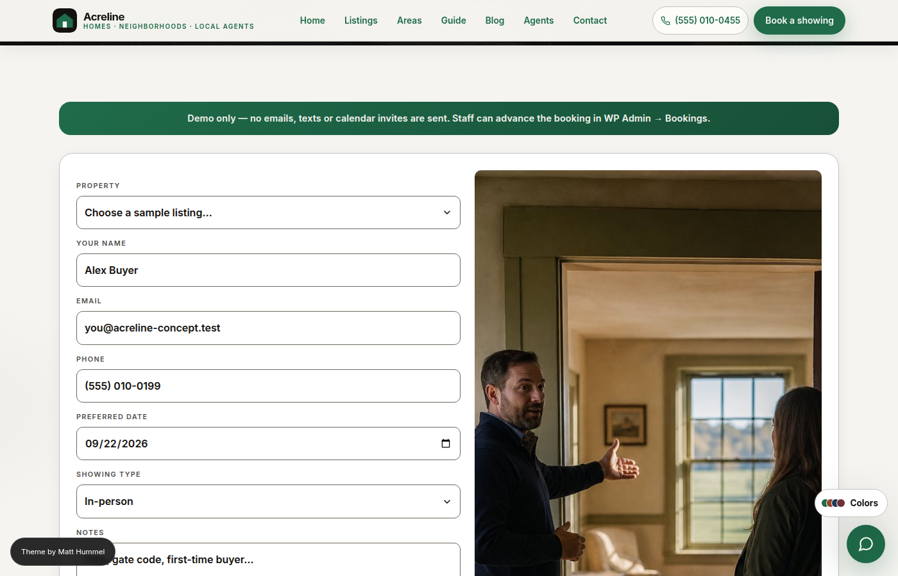
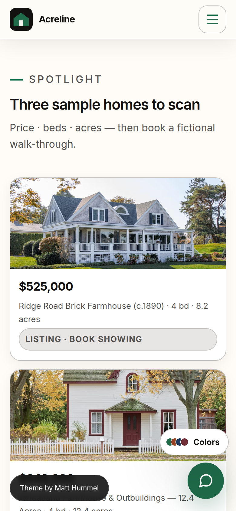
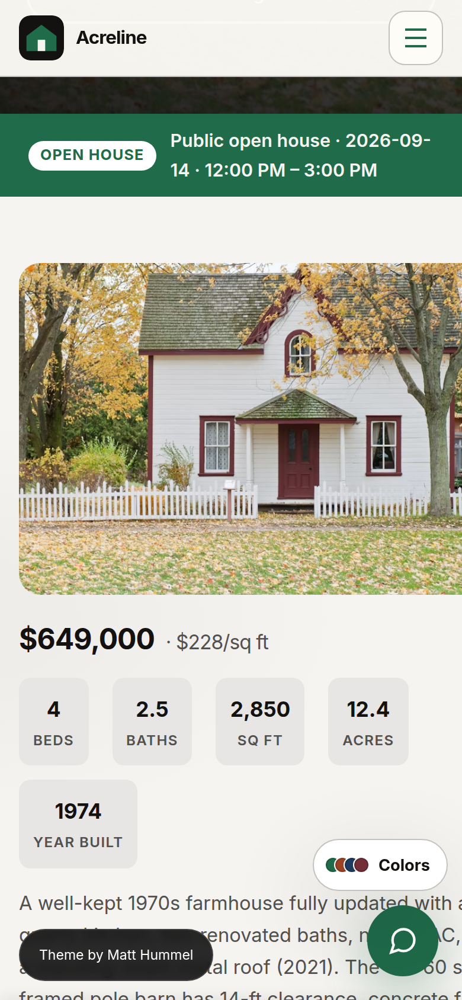

<p align="center">
  <a href="https://acreline.matthummel.com/"></a>
</p>

<p align="center">
  <a href="https://github.com/matthummel-pa/wp-acreline/actions/workflows/main.yml"></a>
  <a href="https://github.com/matthummel-pa/wp-acreline/actions/workflows/deploy.yml"></a>
  <a href="https://github.com/matthummel-pa/wp-acreline/releases/tag/theme-latest"></a>
  <a href="CHANGELOG.md"></a>
  
  
  
  <a href="LICENSE.md"></a>
</p>

# Acreline

**Acreline** is a WordPress theme for **solo real estate agents and small teams**: featured homes, agent bios, and showing requests on Gutenberg marketing pages that the office edits itself. It ships listings, agents, and bookings as proper post types, a five-step setup wizard, eight color styles, and a one-click updater — with **no page builder, no ACF, and no IDX subscription** required on day one.

This README is for three readers: **buyers** evaluating the theme, **developers** who will extend or review it, and **hiring managers** who want to see how I take a WordPress product from an empty scaffold to a marketplace-ready release.

| | |
| --- | --- |
| **Live demo** | [acreline.matthummel.com](https://acreline.matthummel.com/) — fiction-only sample data (`555` phones, `@acreline-concept.test` emails) |
| **Project page** | [matthummel.com/projects/acreline](https://matthummel.com/projects/acreline/) · [support hub](https://matthummel.com/support/acreline/) · [issues](https://github.com/matthummel-pa/wp-acreline/issues) |
| **Stack** | Sage 11 · Acorn 6 · Blade · Tailwind CSS v4 · Vite 8 · PHP 8.3+ · WordPress 6.6+ |
| **Size** | 14 PHP modules (~10k lines) · 42 Blade templates · 42 registered block types · ~5.6k lines of CSS · 39 Customizer + 78 Theme Settings fields |
| **History** | 211 commits on 16 working days · 31 releases (1.0.0 → 1.5.10, Aug 28 → Oct 2026) |
| **Quality gates** | Pint · WordPress Coding Standards on changed lines (`wp-review`) · PHPStan level 5 · Vite build on Node 20/22 · Pint on PHP 8.3/8.4/8.5 · `theme.json` validation |
| **Ships as** | `acreline.zip` (compiled assets + production vendor), optional `acreline-child.zip` and `acreline-core.zip`, HTML buyer docs |
| **License** | [GPLv2 or later](LICENSE.md) · Sage and Acorn remain MIT |

<table>
  <tr>
    <td align="center"><a href="docs/marketplace/screenshots/01-homepage.png"></a><br /><sub><strong>Home</strong> — hero search, spotlight listings</sub></td>
    <td align="center"><a href="docs/marketplace/screenshots/02-listings.png"></a><br /><sub><strong>Listings</strong> — filters, status pills, compare</sub></td>
  </tr>
  <tr>
    <td align="center"><a href="docs/marketplace/screenshots/03-listing.png"></a><br /><sub><strong>Listing</strong> — specs, agent, open house, mortgage calculator</sub></td>
    <td align="center"><a href="docs/marketplace/screenshots/04-agents.png"></a><br /><sub><strong>Agents</strong> — bios, specialties, reviews, stats</sub></td>
  </tr>
  <tr>
    <td align="center"><a href="docs/marketplace/screenshots/07-book.png"></a><br /><sub><strong>Book a showing</strong> — request → confirmed → completed</sub></td>
    <td align="center"><a href="docs/marketplace/screenshots/m-homepage.png"></a> <a href="docs/marketplace/screenshots/m-listing.png"></a><br /><sub><strong>Mobile</strong> — home and listing</sub></td>
  </tr>
</table>

<p align="center"><sub>Twenty content-area and phone captures live in <a href="docs/marketplace/screenshots/">docs/marketplace/screenshots/</a>.</sub></p>

## Contents

- [Why Acreline](#why-acreline)
- [Features](#features)
- [Architecture](#architecture)
- [How it was built](#how-it-was-built)
- [Engineering practices](#engineering-practices)
- [What I learned](#what-i-learned)
- [Install (buyers)](#install-buyers)
- [Develop (this repo)](#develop-this-repo)
- [Release and updates](#release-and-updates)
- [Repository map](#repository-map)
- [Documentation](#documentation)
- [Related repositories](#related-repositories)
- [License and credits](#license-and-credits)

## Why Acreline

Houzez, RealHomes, and WPResidence are built as listing portals: page builder, ACF Pro, an IDX subscription, and a settings panel the size of a CRM. Most agents need a site that shows their homes, their face, and a way to book a showing — and that their office can edit on a Tuesday.

| Decision | What it means for the buyer |
| --- | --- |
| **Core Gutenberg only** | Every marketing page is server-rendered blocks. The editor preview is the live page. No builder license to renew. |
| **Listings, agents, bookings are post types** | Real data with real fields (MLS, HOA, flood zone, open house, virtual tour; agent stats, designations; booking pipeline). Switch themes and **Acreline Core** keeps it all. |
| **Everything a buyer changes is a setting** | Identity, compliance text, colors, typography, top bar, header behavior — Customizer and **Appearance → Acreline Settings**. Zero code for brand changes. |
| **Zero-plugin footprint** | Mortgage calculator, listing compare, saved listings, market snapshot, native SEO tags, contact and booking forms — all in the theme. SEO yields automatically to Yoast / Rank Math / SEOPress / AIOSEO when present. |
| **Honest demo** | Fiction-only data, labelled as such. Not a live MLS, not a licensed brokerage. Marketplace reviewers and buyers see exactly what they get. |
| **Self-hosted fonts** | Ten Customizer fonts ship as `.woff2` — no Google Fonts requests, faster first paint, no visitor IPs leaving the site. |

## Features

<details open>
<summary><strong>Listings, agents, and showings</strong></summary>

- **Listing** post type: type, price, beds, baths, sqft, acres, township, MLS, status; utilities, HOA, school district, flood zone; open house date/time; virtual and video tour; floor plan; green/eco and smart-home chips; outbuildings, tillable and pasture acres.
- **Agent** post type: photo, bio, performance stats (homes sold, volume, average DOM, list-to-sale, reviews), designations, social links, intro video, calendar URL, awards, team.
- **Booking** post type: showing type, date, time, assigned agent, client contact, buyer type, attendees, communication preference; pipeline Requested → Confirmed → Completed.
- **Listing grid** with type / price / area / status filters, grid and map views. **Compare** up to three listings. **Saved listings** drawer (localStorage). **Recently viewed** chips. **Nearby listings** by township, server-rendered.
- **Sticky CTA bar**, **share and print** (Web Share API + print flyer), **mortgage calculator**, `[acreline_market_snapshot]` shortcode.
- Native WordPress media picker on every image field.
</details>

<details open>
<summary><strong>42 server-rendered Gutenberg block types</strong></summary>

Home Hero (Ken Burns photo, mobile tilt), Page Hero, Intent Cards, Featured Listings Spotlight, Booking Form Section, Market Stats, How It Works, Agent Tools, Area Grid, Region Coverage, Pricing Plans, Logo Strip, Newsletter, CTA Band, Intro Section, Listing Grid, Tools Section, Compare Table, Checklist, FAQ List, Reviews, Contact Form, Office Info, Trust Strip, Agent List, Topic Cards, Post Grid, SEO Content, plus page-section wrappers — all registered in [`app/blocks.php`](app/blocks.php) with editor assets in `resources/js/blocks/`.

- **Block Generator** (Tools → Block Generator): compose a custom block from fields without writing PHP.
- **Migrate to Blocks**: converts legacy page copy into block layouts.
- **Eight pages pre-built on install** (Home, Listings, Areas, Guide, Agents, Contact, Book a showing, Blog) from block patterns.
</details>

<details open>
<summary><strong>Customizer, Theme Settings, and the setup wizard</strong></summary>

- **Appearance → Acreline Setup** — five steps: brand, phone, colors, demo content, finish.
- **Customizer**: Identity (name, tagline, phone, email, address, hours, header CTA, footer blurb, demo banner), Compliance (brokerage legal name, licenses, Fair Housing, MLS/IDX slots, privacy/terms, form consent), Colors (Forest · Clay · Navy · Burgundy · Harvest · Lake · Orchard · Charcoal + pickers), Header (sticky, height, hero motion), Top Bar, Typography (five families, 14–20 px base), Social, GitHub token.
- **Appearance → Acreline Settings**: tabbed, iOS-style toggles for listings, agents, bookings, market, labels, general.
- **Appearance → Acreline Support**: quick start, feature reference, shortcode cheatsheet, FAQ, changelog — inside wp-admin.
- **Top bar** (desktop; items fold into the mobile drawer): social, announcement badge, phone/email/address/hours, CTA pill, dismiss, four color styles.
</details>

<details open>
<summary><strong>Accessibility, SEO, performance</strong></summary>

- WCAG 2.2 AA target: contrast-checked color styles, 44 px targets, visible focus, skip link, semantic landmarks, reduced-motion respected by the hero animation and tilt.
- Native SEO: document title, meta description, canonical, Open Graph, Twitter cards, `BreadcrumbList` JSON-LD; steps aside when an SEO plugin is active.
- Server-rendered pages, hashed Vite assets, responsive hero crops (portrait on phones), self-hosted fonts, no third-party scripts.
</details>

<details open>
<summary><strong>Operations</strong></summary>

- **Appearance → Update Theme**: installs the `theme-latest` GitHub Release zip with a read-only PAT (Customizer → GitHub or `KS_GITHUB_TOKEN`). Content and settings are untouched.
- **Demo seed** (Tools → Seed Acreline demo) and `bin/seed-cpts.php` for local data.
- **Packs**: `bin/build-theme-zip.sh`, `bin/build-install-pack.sh`, `bin/build-marketplace-pack.sh` produce the WordPress zip, a regular-host install pack, and the ThemeForest-style pack with HTML docs.
</details>

## Architecture

<p align="center"></p>

**Request.** WordPress resolves the template; `functions.php` boots Acorn and loads the `app/*.php` modules (one concern each: post types, blocks, Block Generator, Customizer, Theme Settings, wizard, support page, demo content, updater, filters, marketplace chrome). Blade views render with `{{ }}` escaping; blocks render server-side so the editor preview matches the page; Vite's manifest maps hashed CSS/JS.

**Content.** Listings, agents, and bookings are post types with meta boxes and a native media picker. The optional **Acreline Core** plugin registers the same types so content survives a theme switch. Everything a buyer changes lives in the Customizer or Theme Settings; demo content is seeded behind a version flag and never overwrites edits.

**Buyer tools.** Calculators, compare, saved listings, and the market snapshot are small JS modules and shortcodes — no external APIs, no accounts. SEO tags are native and defer to a plugin when one is active.

**Ship.** Pull requests run Pint, `wp-review` (WordPress Coding Standards on changed lines), the Vite build on Node 20 and 22, Pint on PHP 8.3–8.5, and `theme.json` validation. Merging to `main` builds `acreline.zip` and the install pack and publishes Release `theme-latest`; `release.yml` cuts version tags. Buyer sites update from wp-admin.

Design tokens: Forest ink `#141210`, paper `#f5f4f1`, accent `#1f6b4a` (hover `#155539`) — see [`BRAND.md`](BRAND.md). Marks: `public/images/brand/acreline-mark.svg` and `acreline-lockup.svg`.

## How it was built

**Starting point.** The visual design began as a static concept, [`realtor-keystone-homes-and-land-theme`](https://github.com/matthummel-pa/realtor-keystone-homes-and-land-theme). On 2026-08-28 I ported it to a fresh Sage 11 scaffold and rebuilt every section as a server-rendered block. 1.0.0 was marketplace-ready: Customizer identity, menus, breadcrumbs with JSON-LD, the setup checklist, the Core plugin, child theme, pack script, `readme.txt`, and credits.

| Version | What landed |
| --- | --- |
| 1.0.x – 1.1 | Marketplace packaging, Core plugin, child theme, Envato-style pack, text domain, credits |
| 1.2.x – 1.3.x | Gutenberg blocks for every page, Block Generator and Migrate to Blocks, eight pre-built pages, setup wizard |
| 1.4.x | Listing data model (utilities, HOA, open house, tours, land fields), agent stats and designations, booking pipeline, compare / saved / recently viewed / nearby |
| 1.5.0 – 1.5.9 | Eight color styles, top bar, typography controls, compliance section, hero motion with reduced-motion support, Theme Settings tabs, Support page |
| 1.5.10 | Self-hosted fonts (no Google requests), sharp portrait hero crop on phones, footer widget contrast |

**Working method.** Small PRs named after the change; every PR gets Pint, WPCS on changed lines, the matrix build, and a review before merge. After each release I audit the live demo (keyboard pass, contrast, Lighthouse) and the marketplace checklist (Theme Check, plugin-territory rules, no admin upsells). The `.cursor/rules/*.mdc` files encode the project's non-negotiables — fiction-only data, WCAG 2.2, native SEO, marketplace rules — so AI-assisted edits stay inside them.

**AI as a pair.** Cursor and Claude draft first versions and run audits; I review, run, and test every line that ships. The commit history is the record: 211 reviewable commits, not a generated dump.

## Engineering practices

| Practice | Here |
| --- | --- |
| **Server-rendered blocks** | `render_callback` for every block; what the editor shows is what visitors get. No block-only React islands. |
| **Content outlives the theme** | Post types mirrored in Acreline Core; demo seed behind a flag; nothing deletes buyer content. |
| **Escape late, sanitize early** | Blade `{{ }}`, `esc_url()` on links, `wp_unslash()` + `sanitize_*()` on every request value, nonce + capability on every write. |
| **Automated gates** | [`main.yml`](.github/workflows/main.yml): Node 20/22 build + `theme.json` check, Pint on PHP 8.3/8.4/8.5. [`wp-review.yml`](.github/workflows/wp-review.yml): WordPress Coding Standards on changed lines. PHPStan level 5 with WordPress stubs. |
| **Marketplace discipline** | `readme.txt`, `CREDITS.md`, GPL notices, `.pot` in `languages/`, Theme Check helpers in `app/marketplace.php`, buyer docs in `docs/marketplace/`. |
| **Accessible by default** | WCAG 2.2 AA rules in `.cursor/rules/accessibility.mdc`; motion honors `prefers-reduced-motion`; 44 px targets; focus rings. |
| **Honest demo** | Fiction-only data, labelled banner, `555` numbers, `.test` emails — enforced by a project rule. |
| **Docs ship with code** | CHANGELOG entry per release; `DEVELOPMENT.md` for the repo, `SUPPORT.md` and HTML docs for buyers. |

## What I learned

1. **A theme for a niche is a data model first.** The listing, agent, and booking fields took longer than any layout — and they are what makes the theme useful rather than pretty.
2. **Put the content in a plugin, even when you ship a theme.** Buyers switch themes. Acreline Core exists so their listings do not vanish when they do.
3. **Server-rendered blocks remove a whole class of "it looked different in the editor" tickets.** One render path, one truth.
4. **Settings beat code for buyers, and settings need a front door.** The five-step wizard turned a 40-field Customizer into a ten-minute setup.
5. **Self-host the fonts.** Dropping Google Fonts was faster, private, and required for WordPress.org rules — all three for one change.
6. **Motion needs an off switch.** Ken Burns and device-tilt are delightful until someone with vestibular issues loads the page; both honor reduced motion and have toggles.
7. **Marketplace rules shape architecture.** "Plugin territory" (no CPTs in a theme) is why Core exists; "no admin upsells" is why the Support page is documentation, not marketing.
8. **Fiction-only data is a feature.** It keeps the demo honest, keeps reviewers calm, and avoids ever implying an MLS feed exists.
9. **Phones need their own hero crop.** A stretched landscape photo on a 390 px screen cost LCP and looked wrong; a portrait source and one download fixed both.
10. **Encode the rules you keep repeating.** The `.mdc` rule files cut review churn more than any single refactor.

## Install (buyers)

1. Extract the outer `acreline-*.zip`. Do **not** upload the outer file.
2. **Appearance → Themes → Add New → Upload Theme** → choose the inner **`acreline.zip`** → Activate. Keep the folder named `acreline`.
3. **Appearance → Acreline Setup** — brand, colors, optional demo seed.
4. **Appearance → Customize → Identity** — phone, email, address, hours, header CTA, logo.
5. Optional: upload `acreline-child.zip` (CSS that survives updates) and `acreline-core.zip` (content that survives a theme switch).

Requirements: WordPress 6.6+, PHP 8.3+, Apache or Nginx. **No Composer or npm on the host** — the zip ships compiled assets and production vendor. Full walkthrough with screenshots: `Documentation/index.html` in the pack, or [docs/marketplace/](docs/marketplace/).

## Develop (this repo)

```bash
git clone https://github.com/matthummel-pa/wp-acreline.git acreline
cd acreline
composer install && npm install && npm run build

# WordPress Studio (Mac) or bin/setup-wp.sh (Linux / cloud) stands up a local site;
# the theme folder must be named `acreline` (Vite base).
wp theme activate acreline
wp acorn view:clear
```

| Command | Purpose |
| --- | --- |
| `npm run dev` / `npm run build` | Vite HMR / production build to `public/build/` |
| `vendor/bin/pint --test` | PHP style |
| `vendor/bin/phpstan analyse` | Static analysis (level 5) |
| `wp-review --base origin/main` | WordPress Coding Standards on changed lines |
| `bin/seed-cpts.php` | Local listings, agents, bookings |
| `bin/build-theme-zip.sh` | The `acreline.zip` a buyer uploads |
| `bin/build-marketplace-pack.sh` | Theme + child + Core + HTML docs pack |

Details: [`DEVELOPMENT.md`](DEVELOPMENT.md) (stack, file map, blocks, packaging, gotchas) · [`AGENTS.md`](AGENTS.md) (cloud setup, project rules).

## Release and updates

```text
PR merged to main
  └─ deploy.yml: composer --no-dev · npm run build · build-theme-zip.sh · build-install-pack.sh
       └─ GitHub Release "theme-latest" (acreline.zip + install pack)
            └─ Buyer site: Appearance → Update Theme → Install latest zip from GitHub
release.yml (manual): bump style.css, commit, tag vX.Y.Z
```

Updates never touch pages, posts, uploads, or settings. [One-click updates](docs/marketplace/buyer-guide.html) need a fine-grained PAT with **Contents: Read**.

## Repository map

```text
app/                 post-types · blocks · block-generator · customizer · theme-settings · setup-wizard · theme-support · demo-content · theme-updater · github · filters · marketplace · setup · admin
resources/views/     Blade layouts, sections, partials, block views
resources/css/       app.css (@theme tokens) + editor.css
resources/js/        Front-end modules and blocks/ editor scripts
plugins/acreline-core/   Companion plugin: listings, agents, bookings
child-theme/         Starter child theme
bin/                 build-theme-zip · build-install-pack · build-marketplace-pack · build-fonts · seed-cpts · setup-wp
docs/marketplace/    Buyer docs hub, guide, compliance checklist, screenshots
docs/assets/readme/  README graphics · docs/archive/ previous READMEs
.github/workflows/   main.yml · wp-review.yml · deploy.yml · release.yml
```

## Documentation

| File | Purpose |
| --- | --- |
| [`SUPPORT.md`](SUPPORT.md) | Support channels, what the theme does not do, security |
| [`DEVELOPMENT.md`](DEVELOPMENT.md) | Local setup, build, file locations, blocks, packaging, deploy |
| [`CHANGELOG.md`](CHANGELOG.md) | Version history |
| [`BRAND.md`](BRAND.md) | Palette and marks |
| [`docs/marketplace/`](docs/marketplace/) | Buyer docs hub (`index.html`), buyer guide, compliance checklist, screenshots |
| [`readme.txt`](readme.txt) · [`CREDITS.md`](CREDITS.md) · [`LICENSE.md`](LICENSE.md) | Marketplace parser file, third-party credits, GPL |
| [`docs/archive/`](docs/archive/) | Earlier versions of this README |

## Related repositories

| Repo | What it is |
| --- | --- |
| [matthummel-theme](https://github.com/matthummel-pa/matthummel-theme) | The site that sells and documents Acreline (project page, shop, support hub) |
| [wp-walkridge](https://github.com/matthummel-pa/wp-walkridge) | Sister theme for guided tours, same Sage 11 foundation, WooCommerce bookings |
| [wp-cobbleandcandle](https://github.com/matthummel-pa/wp-cobbleandcandle) | Block theme for restaurants, taverns, and inns |
| [realtor-keystone-homes-and-land-theme](https://github.com/matthummel-pa/realtor-keystone-homes-and-land-theme) | The static concept Acreline's design was ported from |
| [wp-dev-kit](https://github.com/matthummel-pa/wp-dev-kit) | `wp-review`, review checklist, and the agent rules used across repos |

## License and credits

GPLv2 or later — [`license.txt`](license.txt), [`LICENSE.md`](LICENSE.md). Third-party notices in [`CREDITS.md`](CREDITS.md). Sage and Acorn (Roots) remain MIT. Demo photographs and fonts are listed with their licenses in CREDITS.

Author: [Matt Hummel](https://matthummel.com/) · Live demo: [acreline.matthummel.com](https://acreline.matthummel.com/) · Open for WordPress work: [matthummel.com/hire](https://matthummel.com/hire/)
